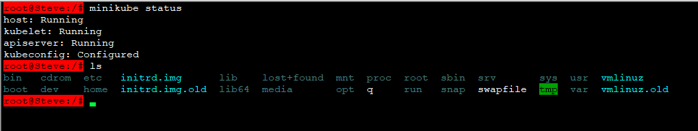

# SecureCRT Highlight Keywords

我本来只想高亮标记我输入的正行命令, 但SecureCRT Highlight Keywords 不能支持empty space, 只能标记输入命令的开始部分



```
// Edit Default Session -> Terminal -> Appearance -> Highlight Keywords, Append the follow Regular Expression
.+@.+:.*$
```
